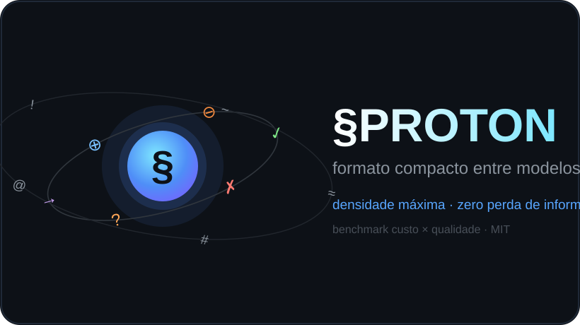

# §PROTON — formato compacto vs prosa na comunicação entre modelos



Benchmark mínimo que mede, com números reais de API, se um "formato compacto entre modelos" — o §PROTO v1, batizado §PROTON neste lançamento — economiza tokens e mantém qualidade quando dois modelos de IA debatem por escrito, comparado com texto corrido normal.

## Resultado principal (DeepSeek, n=40 rodadas: 10 itens × 2 condições × 2 réplicas)

| métrica | prosa | §PROTO | delta |
|---|---|---|---|
| entrada (média) | 328,6 | 356,7 | +8,6% (proto mais caro) |
| saída total (média) | 9.961 | 5.980 | −40,0% |
| — raciocínio interno do modelo | 8.395 | 5.459 | −35,0% |
| — resposta líquida | 1.566 | 522 | −66,7% |
| latência | 52,6 s | 29,9 s | −43,2% |
| caracteres/resposta | 5.599 | 1.502 | −73,2% |

Qualidade (juiz LLM cego): cobertura de rubrica 100% nas duas versões; comparador cego A/B: **§PROTO 9 × 8 prosa** em 17 pares válidos.

**Isso é um empate, e dá pra mostrar com número:** taxa de vitória do §PROTO = 52,9%, IC95% de Wilson = **[31,0% ; 73,8%]**, p = **1,000** (binomial bicaudal, H0: as duas condições são igualmente boas). O intervalo cobre os dois lados do 50%, então estes dados **não sustentam vantagem de qualidade pra nenhum dos formatos** — nem pro §PROTO. Com 17 pares, só uma goleada apareceria: pra detectar uma vantagem real de 60/40 com 80% de poder seriam precisos ~194 pares; pra 55/45, ~783.

A leitura honesta é: **a qualidade não piorou de forma detectável**, e esse era o requisito. A economia de tokens e de latência é que é o resultado.

Leitura: como FORMATO DE RESPOSTA o §PROTO entrega a mesma qualidade com ~1/3 do tamanho e quase metade da latência. Como FORMATO DE ENTRADA não economiza (símbolos custam tokens no tokenizador). O ganho vem do contrato "sem prosa + item a item", não dos símbolos em si.

## O que é o §PROTO v1

Formato compacto inter-modelos. Regra: "Responda SÓ neste formato. Sem prosa. Densidade máxima, zero perda de informação."

✓ concordo · ✗ discordo (+correção) · ? pergunta aberta · → então/implica · ⊕ adicionar · ⊖ cortar · ≈ aproximado · # quantidade · @ fonte/endpoint · ! risco · ~ decisão final.

Spec completa em [docs/PROTO_v1.md](docs/PROTO_v1.md).

## Como reproduzir

Sem instalar nada: só Python 3 e a biblioteca padrão.

```bash
export DEEPSEEK_API_KEY=...                      # ou ANTHROPIC_API_KEY
python runner/run_experiment.py --provider deepseek --model deepseek-flash
python judge/judge.py --provider deepseek        # rubrica + comparador cego
python judge/aggregate.py                        # médias, incerteza e testes
python judge/teste_estatistica.py                # confere a estatística (23 checagens)
```

O `run_experiment.py` grava **uma rodada por arquivo** em `results/out/`, com a resposta
completa, o `usage` da API e a latência medida. O `aggregate.py` lê esses arquivos e
escreve `results/aggregated.json` com média, desvio, IC95% por bootstrap, teste pareado
por item e o veredito do juiz cego.

> **O que ainda não está publicado:** as rodadas brutas da execução de 30/09 não foram
> versionadas (`results/out/` estava no `.gitignore`), então o que está no repositório hoje
> é só o agregado em `results/summary.json`. O `.gitignore` já foi corrigido e a próxima
> execução publica os brutos junto. Até lá, os números desta página são auditáveis
> **re-executando**, não conferindo arquivo por arquivo — e isso é uma limitação real.

## Como a avaliação é cega

- **Rubrica (`judge.py`, 1ª parte):** cada resposta é conferida contra a lista de pontos do
  próprio item em `fixtures/itens.json`. O juiz responde só uma linha de 0 e 1, um por ponto,
  e vago conta como 0.
- **Comparador A/B (`judge.py`, 2ª parte):** as duas respostas do mesmo item vão juntas, sem
  dizer qual é qual. A ordem é sorteada por item com semente fixa (`f'{item}-{rep}-v2'`), e a
  ordem usada fica gravada no resultado — dá pra conferir que o sorteio não enviesou.
- Juiz com temperatura 0; respostas avaliadas com temperatura 0,3.
- Resposta muito longa é cortada pelo meio, mantendo início e fim, igual pras duas condições.

## Como os testes são feitos

Os números vêm de testes **pareados**: cada item roda nas duas condições, então a comparação
é item a item, o que tira da conta a variação entre itens (que aqui é grande). Com 10 itens
dá pra enumerar as 2^10 = 1024 trocas de sinal possíveis, então o p-valor é **exato**, não
aproximado. O placar cego usa binomial exato e IC de Wilson.

`judge/teste_estatistica.py` confere isso contra casos de resposta conhecida antes de qualquer
número ser usado — diferença óbvia tem que dar p baixo, ruído simétrico tem que dar p alto,
9 de 17 tem que dar exatamente 1,0.

## Estrutura

- `fixtures/itens.json` — 10 itens de debate, cada um com a MESMA informação em prosa e em §PROTO + rubrica de avaliação.
- `runner/` — executa o experimento contra a API.
- `judge/` — juiz cego (rubrica binária + comparação A/B com ordem aleatória).
- `results/summary.json` — resultados agregados publicados aqui.
- `docs/` — spec do formato + relatório detalhado.

## Estado

- DeepSeek (deepseek-flash): completo (n=40). Claude (Opus, via CLI): completo (n=20) — MESMO padrão: saída média 10.236 → 3.438 tokens (−66%).
- Nota metodológica: o modelo usado no braço principal tem raciocínio interno cobrado (~85% dos tokens de saída são "thinking"); a coluna "resposta líquida" separa isso.

## Limitações

Em ordem de quanto cada uma enfraquece a conclusão:

1. **Amostra pequena.** 10 itens, 2 réplicas, 40 rodadas no braço principal. Serve pra um efeito
   grande como −40% de tokens; não serve pra afirmar nada sobre qualidade (ver o IC acima).
2. **Um modelo manda no resultado.** O braço principal é `deepseek-flash`. O Claude (n=20)
   repetiu o padrão, mas dois modelos não viram "modelos em geral". Pior: `deepseek-flash` é
   um ponteiro que muda debaixo dos pés, então re-executar meses depois pode dar outro número.
3. **Juiz do mesmo fornecedor.** Quem avalia é um modelo da mesma família de quem responde.
   Isso pode favorecer sistematicamente um estilo de resposta.
4. **Os itens são sintéticos.** São 10 mensagens de debate escritas pro experimento, não tráfego
   real entre agentes. O ganho pode ser outro em conversa de verdade.
5. **Como ENTRADA o formato não economiza** — fica 8,6% mais caro. Os símbolos custam tokens no
   tokenizador. O ganho está todo na saída.
6. **O ganho vem do contrato, não dos símbolos.** "Sem prosa, item a item, densidade máxima"
   é que encurta a resposta. Um controle que peça só concisão, sem símbolo nenhum, provavelmente
   captura boa parte do efeito — e esse controle **não foi rodado**. É o buraco mais sério aqui.
7. **Custo de adoção não foi medido.** Resposta compacta é mais difícil de um humano ler, e
   isso não entrou em nenhuma conta.

## Licença

MIT. Autoria: Bernardo ([@zbern1976](https://github.com/zbern1976)) — desenvolvido com o DeepSeek e o Claude (Anthropic). O §PROTO v1 foi proposto originalmente pelo Claude em sessões de trabalho com o autor (set/2026).
